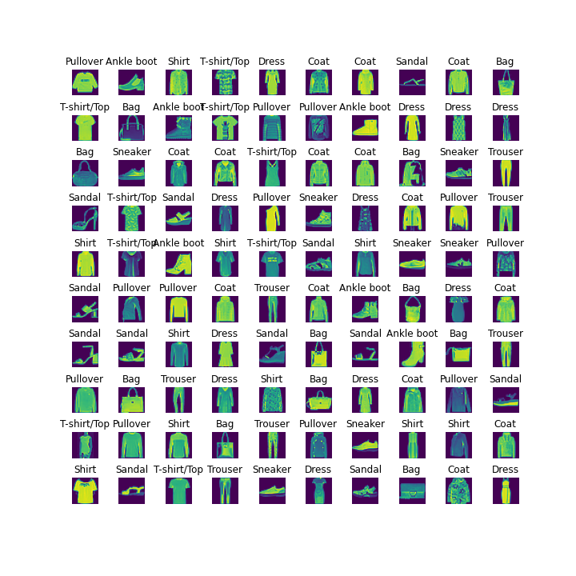

# Supervised Classification Project 
        
# Goals
This project will help me learn how tp
* deal with image datasets.
* Learn the different stages of image classifications.
* Learn how to use and evaluate some classifiers and tools available in Python's sklearn package.
  
# Background

## Dataset
We will be using the FashionMNIST image dataset. Here is a brief description of this dataset from Kaggle [website](https://www.kaggle.com/datasets/zalando-research/fashionmnist):

The Fashion-MNIST dataset consists of 70000 28x28 grayscale images of apparels. There are 60000 training images and 10000 test images.
Here are some sample images from the dataset.

 
## K-Nearest Neighbor (KNN)

k-nearest neighbor (kNN) is a classifier that 
requires no assumptions about the data. It looks at the classes of the k-nearest points and 
picks the most frequent one. The choice of the value of k determines how representative your algorithm is. 

## Support-Vector Machine (SVM)

SVM is a supervised machine learning algorithm which strives to increase the maximum margin hyperplane separating the data classes while training.
Please refer to the class notes for more details. 

## Multi-layer Perceptron (MLP)

MLPs are supervised classification techniques which involve layering of multiple perceptron unit. 
This helps in solving non-linear classification tasks as well as linear classification.

# Instructions


## Exploring oue dataset

Run `utils.py` file to visualize some sample images from the filtered FMNIST dataset with 5000 images for training and 1000 for testing. 
dataset. By default, the code will display a 5x5 grid of random images. 

We will explore the dataset in this way and see what the images look like. We can increase/decrease the number of images displayed as you wish.


## Constructing a Confusion Matrix from Classifier Results

While total accuracy can give us an idea of the predictive power for a given classifier, it does not provide a full picture. In particular, when there are multiple classes being predicted, as is the case for the FMNIST dataset, we wish to know how often our model misclassifies one class for another (for example, how often does our FMNIST classifier mistake a sandal for an ankel boot?). To this end, we can construct a [_confusion matrix_](https://en.wikipedia.org/wiki/Confusion_matrix), where each row of the matrix represents the instances in an actual class while each column represents the instances in a predicted class.


## Evaluating Classifier Models Using Scikit-learn

This will be completed under the `get_model` function (which intializes a classifier model object from sklearn) and `get_model_results` (which evaluates the performace of a given model).

 the given parameters in the model initialization (i.e. `n_neighbors` should be used in KNN, `random_state` and `probability` should be used in SVM, and `hidden_layer_sizes`, `random_state`, and `activation` should be used in MLP). You can read about these parameters in the link mentioned above in the background section.


In order to complete this part we must do the following:

1. Create a classifier model (this is done using the `get_model` function).
2. Train the model using the training sets, which are given as a function arguments.
3. Predict the responses for test dataset, which are given as function argments.
4. Compute model accuracy. You may use `metrics.accuracy_score(...)` from sklearn with documentation linked [here](https://scikit-learn.org/stable/modules/generated/sklearn.metrics.accuracy_score.html).
5. Calculate the confusion matrix from the prediction results on the test data by using the completed the function you coded in problem 1. We ask that you not use an external libary like sklearn to create the confusion matrix and code this function manually.
6. Compute the AUROC score for the test data. You may use `metrics.roc_auc_score(...)`, with documentation linked [here](https://scikit-learn.org/stable/modules/generated/sklearn.metrics.roc_auc_score.html). **Note that you will need to call `model.predict_proba(test_data)` (to retrieve the prediction probabilities) and `multi_class='ovr'` (to specify the one-versus-rest method of evalution for multiclass prediction) as arguments for this function.**

>The AUROC score is another metric for evaluating classifier models that can measure how robust our classifier is in relation to its sensitivity to predicting other class labels (similar to the confusion matrix, but reduced to single scalar value). For more information you may see the sklearn documentation, or this article on the [receiver operating characteristic (ROC)](https://en.wikipedia.org/wiki/Receiver_operating_characteristic).

This function should then return the total accuracy, confusion matrix, and AUROC score for the given classifier model. 
```
1-neighbors result:
Accuracy: 0.802
AUROC Score: 0.8903701493820227
[[ 75.   0.   2.   2.   1.   1.  19.   0.   0.   0.]
 [  0.  83.   0.   3.   0.   0.   1.   0.   0.   0.]
 [  1.   1.  80.   1.  16.   0.  13.   0.   1.   0.]
 [  3.   5.   0.  80.   8.   0.   3.   0.   1.   0.]
 [  3.   0.  16.   8.  63.   0.   5.   0.   1.   0.]
 [  0.   0.   0.   0.   0.  75.   0.   0.   1.   1.]
 [ 15.   0.  13.  10.   8.   2.  57.   0.   2.   0.]
 [  0.   0.   0.   0.   0.  10.   0.  96.   1.   1.]
 [  0.   0.   0.   0.   0.   2.   2.   0.  90.   0.]
 [  1.   0.   0.   0.   0.   7.   0.   6.   1. 103.]]

2-neighbors result:
Accuracy: 0.806
AUROC Score: 0.9306404632252688
[[84.  1.  5.  7.  1.  1. 24.  0.  1.  0.]
 [ 0. 85.  0.  5.  0.  0.  1.  0.  0.  0.]
 [ 3.  0. 91.  1. 32.  1. 21.  0.  3.  0.]
 [ 3.  3.  0. 86.  9.  1.  1.  0.  0.  0.]
 [ 2.  0. 10.  1. 50.  0.  8.  0.  2.  0.]
 [ 0.  0.  0.  0.  0. 85.  0.  0.  1.  1.]
 [ 6.  0.  5.  4.  4.  0. 43.  0.  3.  0.]
 [ 0.  0.  0.  0.  0.  5.  0. 98.  1.  6.]
 [ 0.  0.  0.  0.  0.  1.  2.  0. 86.  0.]
 [ 0.  0.  0.  0.  0.  3.  0.  4.  1. 98.]]

3-neighbors result:
Accuracy: 0.815
AUROC Score: 0.9454954476236622
[[ 81.   1.   3.   5.   2.   1.  20.   0.   1.   0.]
 [  0.  85.   1.   2.   0.   0.   1.   0.   0.   0.]
 [  3.   1.  84.   1.  16.   1.  15.   0.   3.   0.]
 [  1.   1.   0.  85.   5.   0.   1.   0.   0.   0.]
 [  2.   1.  15.   5.  64.   0.   5.   0.   1.   0.]
 [  0.   0.   0.   0.   0.  76.   0.   0.   1.   0.]
 [ 11.   0.   8.   6.   9.   1.  55.   0.   3.   0.]
 [  0.   0.   0.   0.   0.  13.   0.  97.   1.   4.]
 [  0.   0.   0.   0.   0.   2.   3.   0.  87.   0.]
 [  0.   0.   0.   0.   0.   3.   0.   5.   1. 101.]]

4-neighbors result:
Accuracy: 0.814
AUROC Score: 0.9535589500049835
[[ 87.   1.   3.   4.   1.   0.  21.   0.   0.   0.]
 [  0.  84.   0.   2.   0.   0.   0.   0.   0.   0.]
 [  3.   1.  85.   2.  21.   0.  17.   0.   2.   0.]
 [  1.   2.   0.  86.   7.   0.   1.   0.   0.   0.]
 [  2.   1.  16.   5.  57.   0.   4.   0.   0.   0.]
 [  0.   0.   0.   0.   0.  76.   0.   0.   1.   0.]
 [  5.   0.   7.   5.  10.   3.  54.   0.   7.   0.]
 [  0.   0.   0.   0.   0.  13.   0.  99.   1.   5.]
 [  0.   0.   0.   0.   0.   1.   3.   0.  86.   0.]
 [  0.   0.   0.   0.   0.   4.   0.   3.   1. 100.]]

5-neighbors result:
Accuracy: 0.811
AUROC Score: 0.9586000624655426
[[ 80.   0.   3.   4.   1.   1.  21.   0.   0.   0.]
 [  0.  85.   0.   2.   0.   0.   1.   0.   0.   0.]
 [  4.   1.  83.   1.  21.   0.  17.   0.   2.   0.]
 [  3.   3.   0.  88.   6.   0.   1.   0.   0.   0.]
 [  1.   0.  17.   5.  61.   0.   5.   0.   1.   0.]
 [  0.   0.   0.   0.   0.  78.   0.   0.   1.   0.]
 [ 10.   0.   8.   4.   7.   1.  52.   0.   5.   0.]
 [  0.   0.   0.   0.   0.  13.   0.  96.   2.   3.]
 [  0.   0.   0.   0.   0.   1.   3.   0.  86.   0.]
 [  0.   0.   0.   0.   0.   3.   0.   6.   1. 102.]]

SVM Result
Accuracy: 0.845
AUROC Score: 0.987231866899325
[[ 77.   0.   2.   2.   0.   0.  14.   0.   0.   0.]
 [  0.  85.   0.   0.   0.   0.   0.   0.   0.   0.]
 [  4.   1.  82.   0.  11.   0.  10.   0.   1.   0.]
 [ 10.   3.   0.  97.   5.   0.   5.   0.   0.   0.]
 [  0.   0.  16.   2.  70.   0.   7.   0.   0.   0.]
 [  0.   0.   0.   0.   0.  87.   0.   2.   1.   1.]
 [  7.   0.  11.   3.  10.   0.  61.   0.   2.   0.]
 [  0.   0.   0.   0.   0.   7.   0.  92.   0.   3.]
 [  0.   0.   0.   0.   0.   2.   3.   0.  93.   0.]
 [  0.   0.   0.   0.   0.   1.   0.   8.   1. 101.]]

MLP Result
Accuracy: 0.825
AUROC Score: 0.9817698052529863
[[ 74.   1.   3.   2.   1.   0.  12.   0.   2.   0.]
 [  0.  85.   0.   0.   0.   0.   1.   0.   0.   0.]
 [  4.   0.  87.   0.  24.   0.  16.   0.   2.   0.]
 [  4.   2.   1.  93.   4.   0.   1.   0.   0.   0.]
 [  0.   1.   8.   2.  56.   0.   3.   0.   1.   0.]
 [  0.   0.   1.   0.   0.  82.   0.   0.   0.   2.]
 [ 16.   0.  11.   7.  11.   0.  62.   0.   1.   0.]
 [  0.   0.   0.   0.   0.  10.   0.  97.   3.   1.]
 [  0.   0.   0.   0.   0.   0.   4.   0.  88.   1.]
 [  0.   0.   0.   0.   0.   5.   1.   5.   1. 101.]]

```
